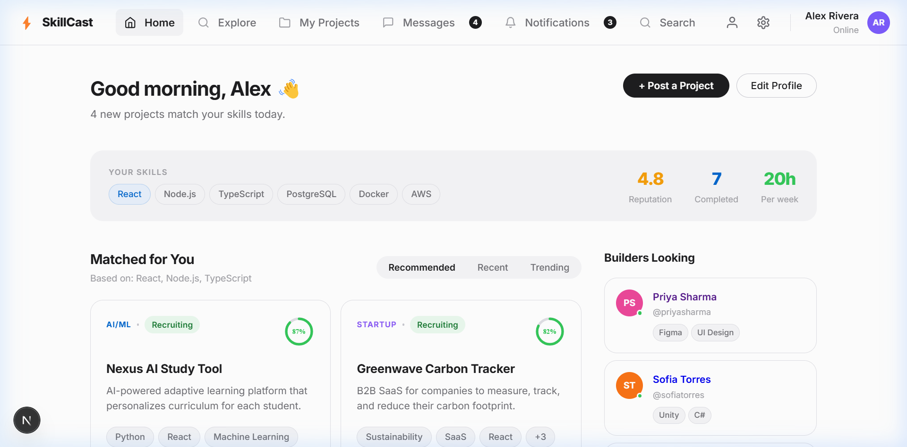
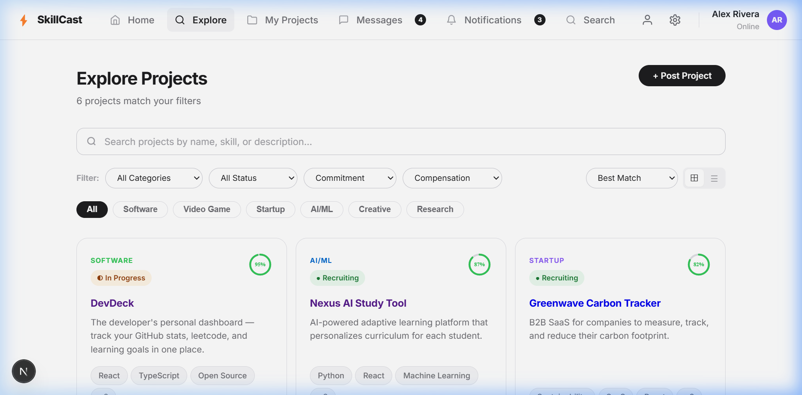
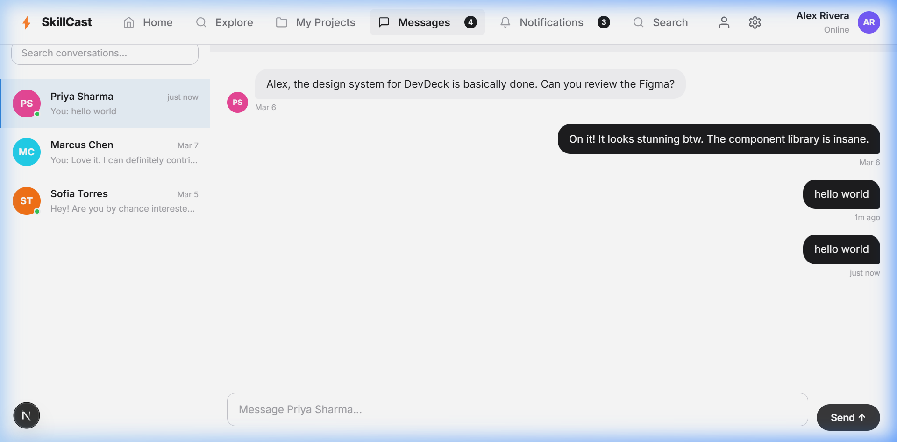

# SkillCast — Find Your Dream Team

SkillCast is a premium, state-of-the-art collaboration platform designed to bridge the gap between idea-stage projects and talented builders. Whether you're a developer, designer, or product manager, SkillCast helps you find high-impact projects that match your unique skill set.

## 🚀 Experience the Platform

### 📊 Personalized Dashboard
The **Home Dashboard** serves as your mission control. It intelligently matches you with projects based on your specific tech stack (React, Node.js, TypeScript, etc.) and tracks your reputation and completion metrics.



### 🔍 Project Exploration
Our **Explore** page allows you to dive into a curated list of active projects. Filter by industry (AI/ML, FinTech, SaaS), required roles, and tech requirements to find exactly where you can make the most impact.



### 💬 Real-time Collaboration
Collaboration is at the heart of SkillCast. Our integrated **Messaging System** provides a sleek, real-time chat interface where you can discuss project details, share designs, and coordinate with your team members seamlessly.



---

## 🛠️ Technology Stack

- **Framework**: Next.js 14 (App Router)
- **Language**: TypeScript
- **Styling**: Vanilla CSS with modern Design Tokens
- **Icons**: Lucide React
- **UI Architecture**: Responsive Top-Navigation layout

## ⚙️ Getting Started

First, install the dependencies:

```bash
npm install
```

Then, run the development server:

```bash
npm run dev
```

Open [http://localhost:3000](http://localhost:3000) with your browser to see the live application.
